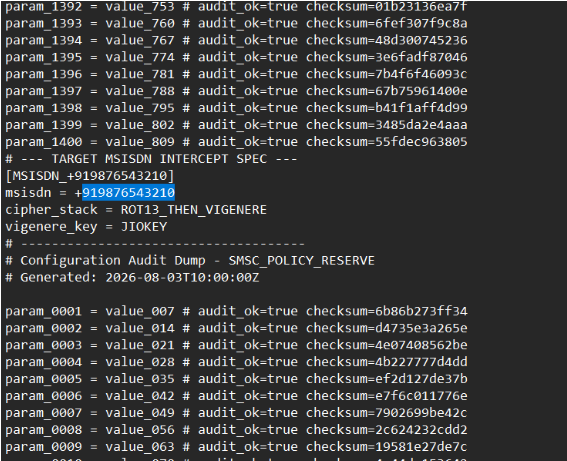
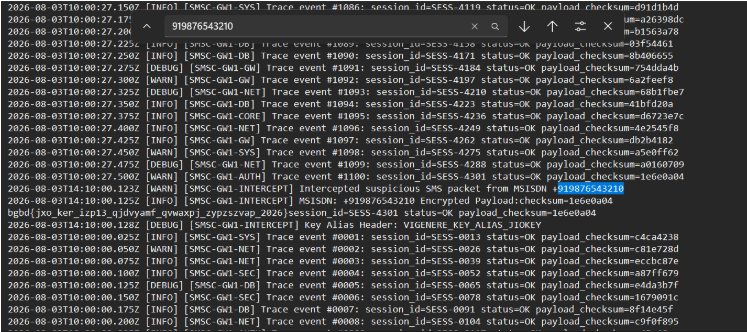
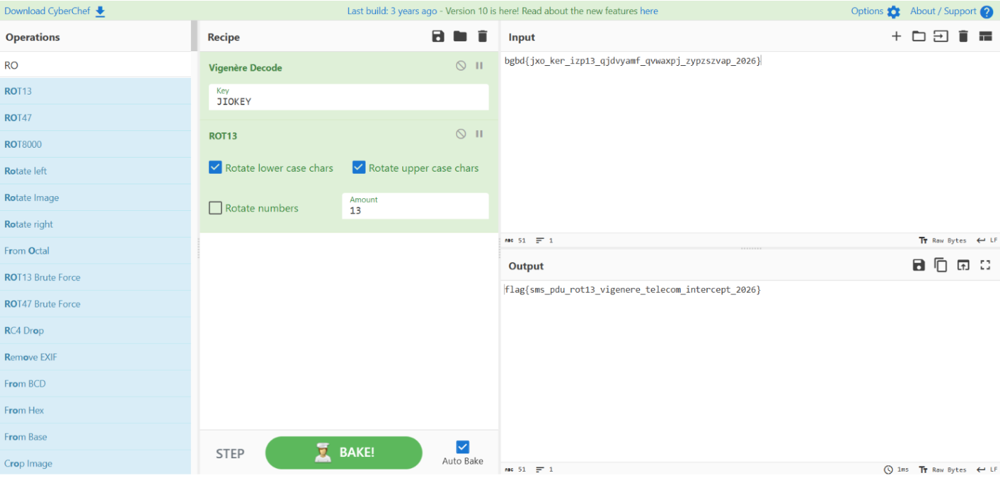

# Intercepted Independence Activation SMS

## Challenge Details

| Field | Value |
|---------|---------|
| Challenge Name | Intercepted Independence Activation SMS |
| Category | Cryptography / Forensics |
| Difficulty | Easy |
| Platform | CSEMA Cyber Security Practice Lab |
| Points | 100 |

---

## Challenge Description


The challenge simulates a telecom security investigation during an Independence Day cyber defence exercise.

A suspicious SMS activation message was intercepted inside a simulated Jio SMS Gateway environment. The challenge provides two forensic artifacts:

- `gsm_7bit_intercept.conf`
- `sms_gateway_routing.txt`

The objective is to identify the encryption parameters, locate the intercepted SMS payload, reverse the encryption process, and recover the hidden message.

---

## Files Provided

### 1. gsm_7bit_intercept.conf

This file contains SMS gateway configuration information and encryption parameters.

### 2. sms_gateway_routing.txt

This file contains SMS routing logs and intercepted message data.

---

# Solution

## Step 1 – Analyze the Configuration File

I first opened the `gsm_7bit_intercept.conf` file and searched for anything unusual.



The following section immediately stood out:

```text
[MSISDN:+919876543210]
msisdn = +919876543210
cipher_stack = ROT13_THEN_VIGENERE
vigenere_key = JIOKEY
```

### Information Recovered

| Parameter | Value |
|------------|---------|
| MSISDN | +919876543210 |
| Cipher Stack | ROT13_THEN_VIGENERE |
| Vigenère Key | JIOKEY |

This tells us:

1. The intercepted message belongs to the MSISDN `+919876543210`
2. Two ciphers were used:
   - ROT13
   - Vigenère Cipher
3. The Vigenère key is `JIOKEY`

---

## Step 2 – Search the Routing Log

Using the recovered MSISDN, I searched inside `sms_gateway_routing.txt`.



The following log entry was found:

```text
2026-08-03T14:10:00.125Z [INFO] [SMSC-GW1-INTERCEPT]
MSISDN:+919876543210
Encrypted payload:
bgbd{jxo_ker_izp13_qjdvyamf_qvwaxpj_zypzszvap_2026}
```

The encrypted payload appears to be the hidden flag.

---

## Step 3 – Understand the Cipher Stack

From the configuration file:

```text
cipher_stack = ROT13_THEN_VIGENERE
```

The original encryption process was:

```text
Plaintext
    ↓
ROT13
    ↓
Vigenère Cipher (Key: JIOKEY)
    ↓
Ciphertext
```

To decrypt the message, the operations must be reversed:

```text
Ciphertext
    ↓
Vigenère Decode (Key: JIOKEY)
    ↓
ROT13 Decode
    ↓
Plaintext
```

---

## Step 4 – Decrypt Using CyberChef

### CyberChef Recipe



1. Add **Vigenère Decode**
   - Key: `JIOKEY`

2. Add **ROT13**

3. Paste the encrypted payload:

```text
bgbd{jxo_ker_izp13_qjdvyamf_qvwaxpj_zypzszvap_2026}
```

### CyberChef Workflow

```text
Input:
bgbd{jxo_ker_izp13_qjdvyamf_qvwaxpj_zypzszvap_2026}

↓ Vigenère Decode (JIOKEY)

↓ ROT13

Output:
flag{sms_pdu_rot13_vigenere_telecom_intercept_2026}
```

---

## Flag

```text
flag{sms_pdu_rot13_vigenere_telecom_intercept_2026}
```

---

# What I Learned

- Configuration files often contain critical forensic evidence.
- Identifying encryption parameters can simplify cryptographic challenges.
- The order of encryption matters; decryption must be performed in reverse order.
- CyberChef is extremely useful for quickly testing and reversing cipher chains.

---

# Tools Used

- CyberChef
- Text Editor
- Linux Search / Grep
- Basic Cryptography Analysis

---

# Conclusion

This challenge required investigating telecom gateway artifacts to recover a hidden SMS activation message. By examining the configuration file, I identified the encryption scheme and Vigenère key. Using the recovered MSISDN, I located the encrypted payload inside the routing logs. Reversing the cipher stack in CyberChef successfully revealed the original message and the challenge flag.

## Final Flag

```text
flag{sms_pdu_rot13_vigenere_telecom_intercept_2026}
```
