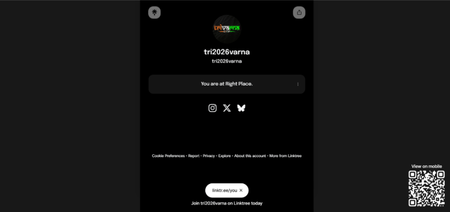
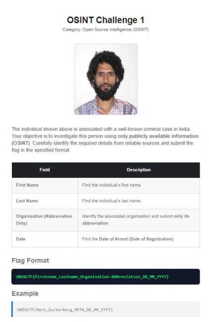
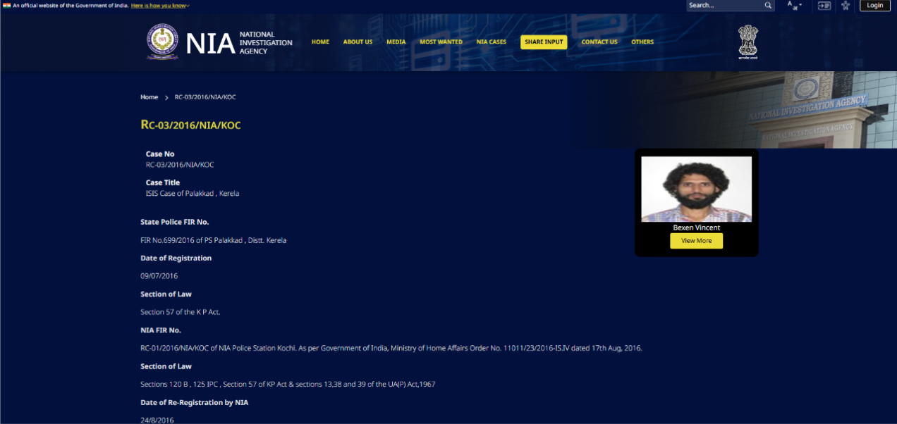

# U - Digital Footprints 1

## Challenge Information

| Field | Value |
|---------|---------|
| Category | OSINT |
| Difficulty | Easy |
| Event | Trivarna 2026 |

---

## Challenge Description


The challenge provided a single clue:

```text
Username: tri2026varna
```

The objective was to perform Open Source Intelligence (OSINT) investigation and identify the individual associated with the challenge.

---

## Step 1 – Investigating the Username

The provided clue was:

```text
tri2026varna
```

I performed Google dorking using:

```text
intitle:tri2026varna
```

### Screenshot



---

## Step 2 – Discovering the Challenge Website

The search results led to a webpage associated with the challenge.

On the webpage, I found:

- Additional challenge information
- Flag format
- Instructions for identifying the individual

### Screenshot


---

## Step 3 – Analyzing the Challenge Image

The challenge page contained an image of a person suspected to be associated with a criminal organization.

The objective was to identify:

- First Name
- Last Name
- Organization
- Date

according to the specified flag format.

### Screenshot



---

## Step 4 – Reverse Image Search

I performed a reverse image search using Google Images.

The search results matched records available on the National Investigation Agency (NIA) website.

### Screenshot



---

## Findings

| Field | Value |
|---------|---------|
| First Name | Bexen |
| Last Name | Vincent |
| Organization | ISIS |
| Date | 09_07_2016 |

---

## Flag

```text
TRIVARNA{Bexen_Vincent_ISIS_09_07_2016}
```

---

## Tools Used

- Google Search
- Google Dorking
- Reverse Image Search
- National Investigation Agency (NIA) Records

---

## Conclusion

Starting with only the username `tri2026varna`, I used Google dorking to locate the challenge webpage. The webpage provided an image of the target individual and the required flag format. A reverse image search led to an NIA record that revealed the individual's identity and associated organization. Combining the discovered information produced the final flag.

## Final Flag

```text
TRIVARNA{Bexen_Vincent_ISIS_09_07_2016}
```
